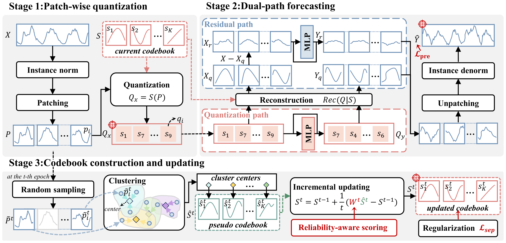
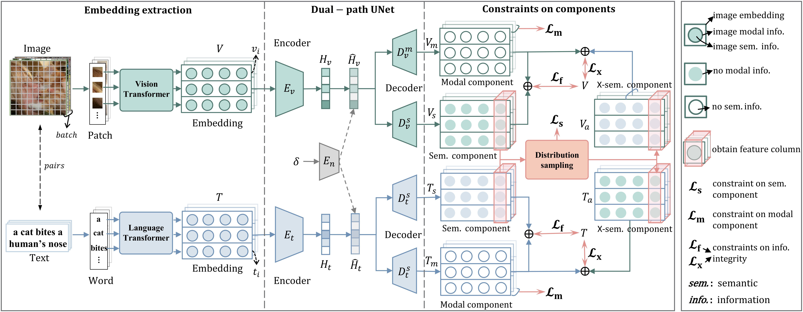
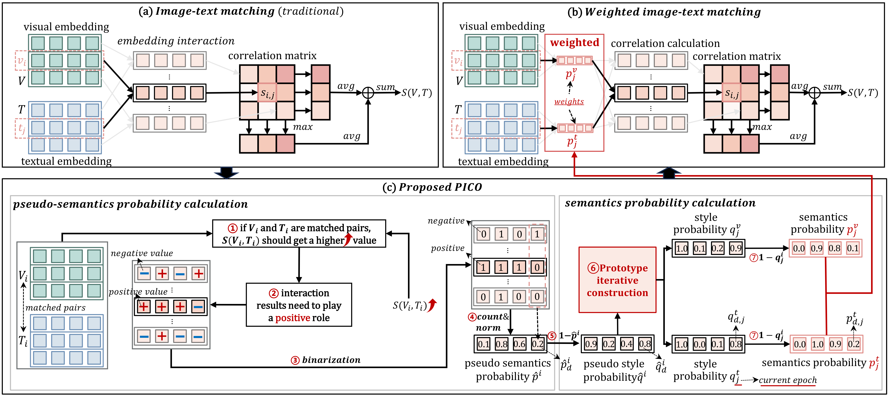
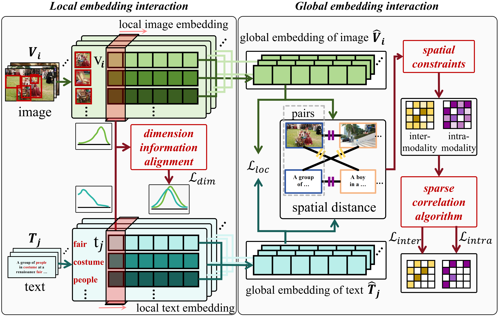
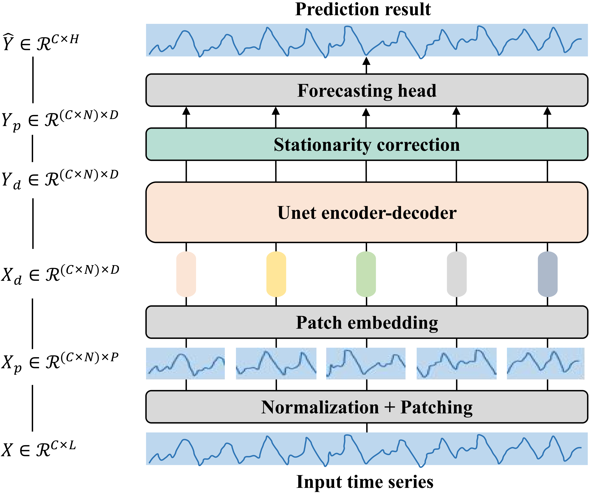
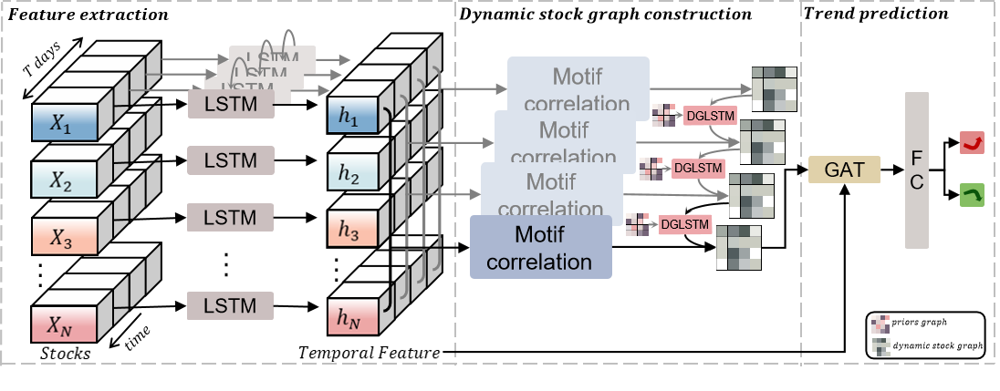
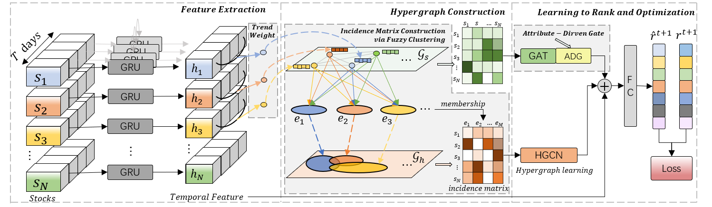
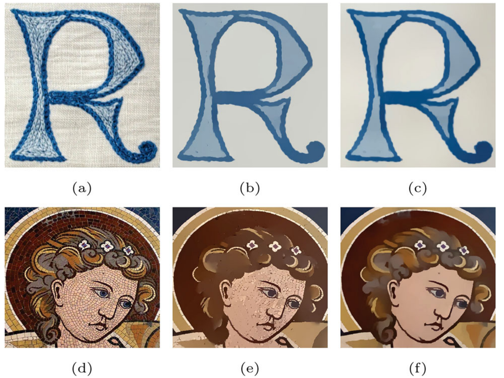








# 😄 About me

I am currently a Postdoc at the school of Software, Shandong University, supervised by [Prof.Lizhen Cui](https://faculty.sdu.edu.cn/cuilizhen/en/index.htm). Previously, I received my doctoral degree from School of Software, Shandong University, under the supervision of [Prof.Caiming Zhang](https://www.sc.sdu.edu.cn/info/1046/2286.htm).

My research interests mainly include time series analysis and multimodal information fusion. The central aim of my research is to capture the dynamics of our ever-changing world through rigorous scientific inquiry and to bridge the gap between fundamental theory and practical implementation.

## Education

Ph.D. in Software Engineering, 2020-2024
School of Software, Shandong University

Master in Computer Science and Technology, 2017-2020
School of Computer Science and Technology, Shandong University

Bachelor in Computer Science and Technology, 2013-2017
School of Computer Science and Technology, China University of Geosciences, Wuhan

# 🔥 News

- **2025.11**: &nbsp;🎉🎉 Two papers are accepted by **AAAI 2026**. (1 Oral & 1 Poster)
- **2025.11**: One paper is accepted by **ESWA**. Congrats to Pengcheng Wang.
- **2025.11**: One paper is accepted by **ESWA**. Congrats to [Taihua Chen](https://openreview.net/profile?id=%7ETaihua_Chen1).
- **2025.08**: &nbsp;🎉🎉 Won the CCF CAD/CG 2025 Best Poster Award.
- **2025.07**: One paper is accepted by **ACM MM 2025**.
- **2025.07**: &nbsp;🎉🎉 Received funding by the Postdoctoral Fellowship Program of CPSF.
- **2025.02**: One paper is accepted by **CVPR 2025**. Congrats to [Lexin Fang](https://shaunma01.github.io/xiangma.github.io/).
- **2025.02**: One paper is accepted by **PR**. Congrats to [Tianlong Zhao](https://scholar.google.com/citations?user=9RhnDboAAAAJ).
- **2025.01**: One paper is accepted by **NN**. Congrats to Guangpo Tian.
- **2024.10**: One paper is accepted by **ACM MM 2024**.
- **2024.10**: &nbsp;🎉🎉 Awarded the PhD degree in Engineering.
- **2024.03**: One paper is accepted by **AAAI 2024**.
- **2024.03**: &nbsp;🎉🎉 Rated as the Outstanding Graduate of Shandong University.
- **2023.08**: One paper is accepted by **Information Processing & Management**.
- **2022.09**: One paper is accepted by **INS**.
- **2021.05**: One paper is accepted by **CVM**.

# ✨ Funding

- Postdoctoral Fellowship Program of CPSF.
- Quantitative analysis and modeling of financial big data (horizontal funding)

# 📝 Publications 

  

    

      
AAAI 2026

      
    

  

  

[ReCast: Reliability-aware Codebook assisted Lightweight Time Series Forecasting](https://arxiv.org/abs/2511.11991)  
**Xiang Ma**, Taihua Chen, Pengcheng Wang, Xuemei Li, Caiming Zhang
In *Proceedings of The Fortieth AAAI Conference on Artificial Intelligence (**AAAI-26**)*, 2025. (Oral)

  

  

    

      
AAAI 2026

      
    

  

  

Aligning the True Semantics: Constrained Decoupling and Distribution Sampling for Cross-Modal Alignment
**Xiang Ma**, Lexin Fang, Litian Xu, Caiming Zhang  
In *Proceedings of The 40th AAAI Conference on Artificial Intelligence (**AAAI-26**)*, 2025.

  

  

    

      
MM 2025

      
    

  

  

[Reliable Cross-modal Alignment via Prototype Iterative Construction](https://arxiv.org/abs/2510.11175)  
**Xiang Ma**, Litian Xu, Lexin Fang, Caiming Zhang, Lizhen Cui 
In *Proceedings of The 33rd ACM International Conferenceon Multimedia (**MM-25**)*, 2025.

  

  

    

      
MM 2024

      
    

  

  

[Bridging the Modality Gap: Dimension Information Alignment and Sparse Spatial Constraint for Image-Text Matching](https://arxiv.org/abs/2410.16853)  
**Xiang Ma**, Xuemei Li, Lexin Fang, Caiming Zhang 
In *Proceedings of The 32nd ACM International Conferenceon Multimedia (**MM-24**)*, 2024.

  

  

    

      
AAAI 2024

      
    

  

  

[U-Mixer: An Unet-Mixer Architecture with Stationarity Correction for Time Series Forecasting](https://arxiv.org/abs/2401.02236)  
**Xiang Ma**, Xuemei Li, Lexin Fang, Tianlong Zhao, Caiming Zhang
In *Proceedings of The 38th AAAI Conference on Artificial Intelligence (**AAAI-24**)*, 2024.

  

  

    

      
IPM

      
    

  

  

[Dynamic graph construction via motif detection for stock prediction](https://www.sciencedirect.com/science/article/pii/S0306457323002170)  
**Xiang Ma**, Xuemei Li, Wenzhi Feng, Lexin Fang, Caiming Zhang
*Information Processing & Management (**IPM**)*, 2023.

  

  

    

      
INS

      
    

  

  

[Fuzzy hypergraph network for recommending Top-K profitable stocks](https://www.sciencedirect.com/science/article/pii/S0020025522010556)  
**Xiang Ma**, Tianlong Zhao, Qiang Guo, Xuemei Li, Caiming Zhang
*Information Sciences (**INS**)*, 2022.

  

  

    

      
CVM

      
    

  

  

[Image smoothing based on global sparsity decomposition and a variable parameter](https://link.springer.com/article/10.1007/s41095-021-0220-1)  
**Xiang Ma**, Xuemei Li, Yuanfeng Zhou, Caiming Zhang
*Computational Visual Media (**CVM**)*, 2021.

  

  
# 🎖 Honors and Awards
- **2025.08**: The CCF CAD/CG 2025 Best Poster Award.
- **2024.03**: The Outstanding Graduate of Shandong University.

# ✨ Academic Service
- The Annual AAAI Conference on Artificial Intelligence 2026 (AAAI'26), PC Member.
- IEEE Transactions on Neural Networks and Learning Systems (TNNLS), Reviewer.
- Applied Soft Computing, Reviewer.
  
# 🌐 Contact

- **Email**: &nbsp; xiangma@sdu.edu.cn

  

